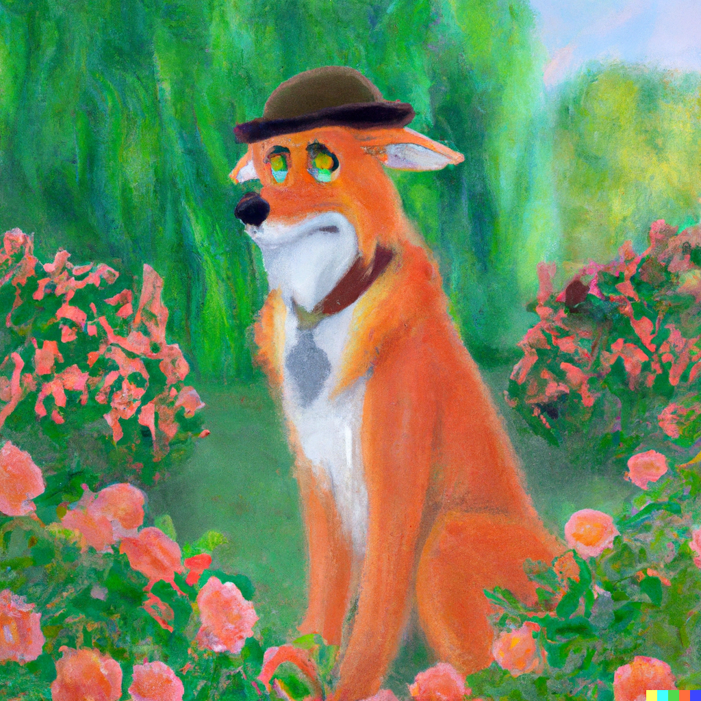

# Oranges2Apples
Welcome to Oranges2Apples! The fun discord game to generate wacky images! We are hoping to release the Alpha around October 1st.

*The images in-game are generated by Dalle2 (https://openai.com/dall-e-2/)*

## Samples
 While you wait, enjoy these samples!
 1. "Michael Jordan dunking a basketball in a jungle in a fluorescent bioluminescent style"
 2. "Todd from Disney's The Fox and the Hound in a rose garden in the style of Monet"
 3. "A fisher price bear in a Nebula"
 |  | 
## In-Game Commands
  Coming soon! Approx closed Alpha release is October 1st, 2022.
## License
  Coming soon! Approx closed Alpha release is October 1st, 2022.
## Setup
  Coming soon! Approx closed Alpha release is October 1st, 2022.
## Usage
  Coming soon! Approx closed Alpha release is October 1st, 2022.
